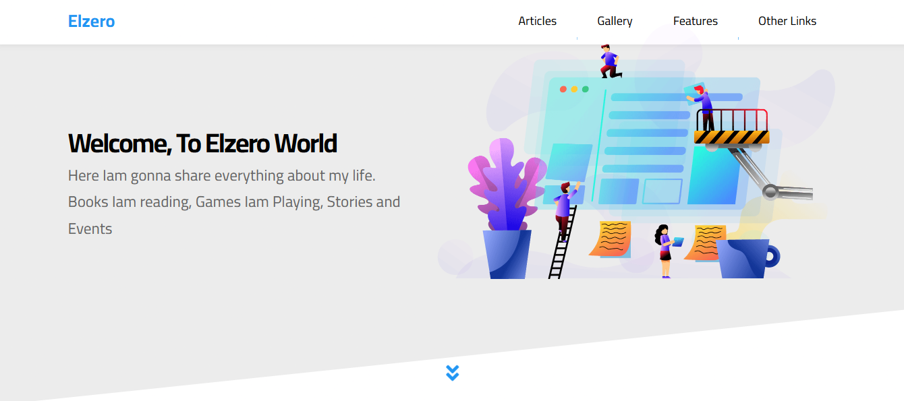
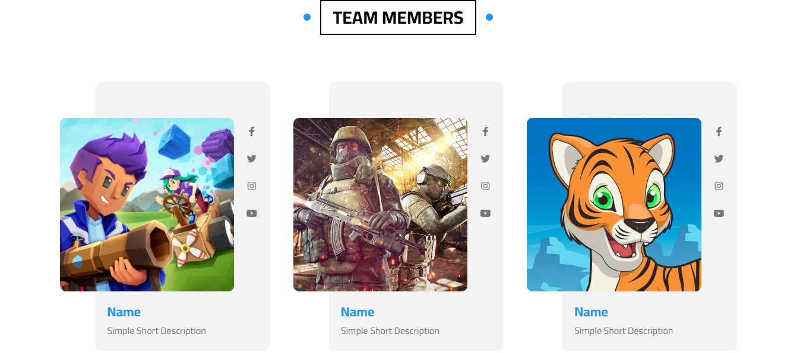
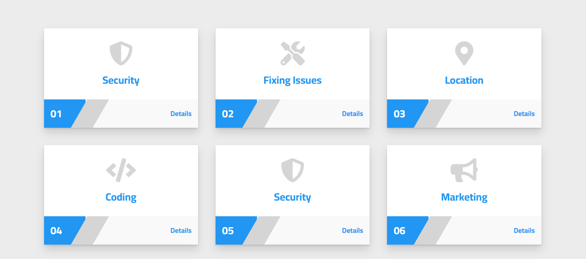

# Elzero HTML & CSS Project 3

A responsive multi-section website built using **HTML5 and CSS3**, inspired by Elzero Web School's HTML & CSS Template Three.

This project was created as part of my front-end development practice to strengthen my HTML and CSS skills and improve my ability to build modern, responsive web interfaces.

## ✨ Features

- Fully responsive design
- Semantic HTML5 structure
- Responsive navigation
- Mega menu
- Landing section
- Articles section
- Gallery section
- Features section
- Testimonials section
- Team Members section
- Services section
- Skills section
- How It Works section
- Events section
- Pricing section
- Video section
- Statistics section
- Discount section
- Contact section
- Footer

## 🛠️ Technologies

- HTML5
- CSS3
- Flexbox
- CSS Grid
- Media Queries
- Font Awesome
- Google Fonts

## 📂 Project Structure

Elzero-HTML-CSS-Project3/
│
├── CSS/
│   ├── Elzero.css
│   ├── normalize.css
│   └── all.min.css
│
├── images/
│
├── webfonts/
│
├── index.html
└── README.md

## 🎯 What I Practiced

Through this project, I practiced:

- Building large multi-section web pages using HTML and CSS
- Creating responsive layouts with Flexbox and CSS Grid
- Using CSS Media Queries for different screen sizes
- Building a responsive navigation bar
- Creating a mega menu
- Working with cards and grid-based layouts
- Styling forms and interactive-looking components
- Using background images and overlays
- Working with Font Awesome icons
- Organizing a larger front-end project
- Writing clean and reusable CSS
- Improving responsive web design skills

## 📸 Preview

## 🚀 Project Status

Completed as part of my **Front-End Development learning journey**.

## 👩‍💻 Author

**Hagar Khaled Niazi**

Front-End Developer in progress.