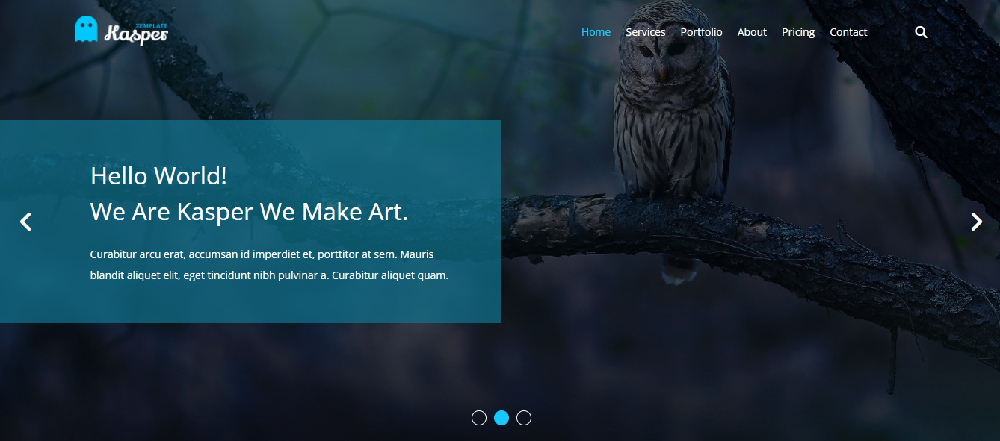
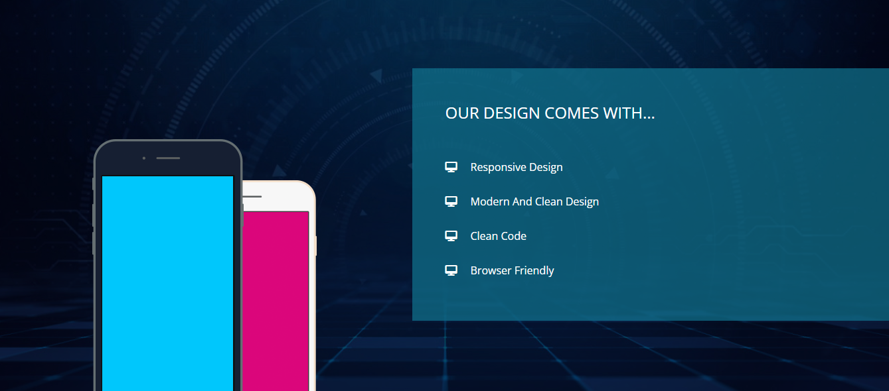
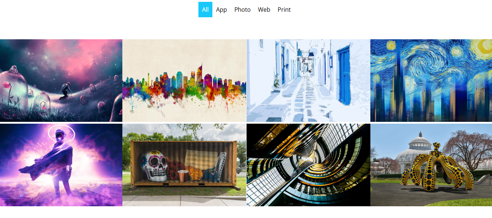

# Kasper HTML & CSS Project 2

A responsive landing page built using **HTML5 and CSS3**, inspired by the Kasper Template from **Elzero Web School**.

This project was created as part of my front-end development practice to strengthen my CSS skills and improve my ability to build structured and responsive web pages.

## ✨ Features

* Fully responsive layout
* Semantic HTML5 structure
* Responsive navigation
* Hero/landing section
* Services section
* Portfolio section
* Video section
* About section
* Pricing section
* Quote section
* Contact section
* Footer
* Responsive images and content

## 🛠️ Technologies

* HTML5
* CSS3
* Flexbox
* CSS Grid
* Media Queries

## 📂 Project Structure

```text
Kasper-HTML-CSS-Project2/
│
├── css/
│   ├── normalize.css
│   ├── all.min.css
│   └── kasper.css
│
├── images/
│   ├── landing.jpg
│   ├── logo.png
│   ├── about.png
│   ├── design-features.jpg
│   ├── mobile.png
│   ├── quote.jpg
│   ├── skills-01.jpg
│   ├── skills-02.jpg
│   ├── stats.png
│   └── ...
│
├── index.html
└── README.md
```

## 🎯 What I Practiced

Through this project, I practiced:

* Building complete web page layouts using HTML and CSS
* Creating responsive layouts with Flexbox and CSS Grid
* Working with media queries
* Structuring multiple sections within a single-page website
* Styling navigation bars and landing sections
* Creating responsive portfolio and content layouts
* Working with background images and overlays
* Organizing CSS and project assets
* Improving my responsive web design skills

## 📸 Preview







## 🚀 Project Status

Completed as part of my **Front-End Development learning journey**.

## 👩‍💻 Author

**Hagar Khaled Niazi**

Front-End Developer in progress.
