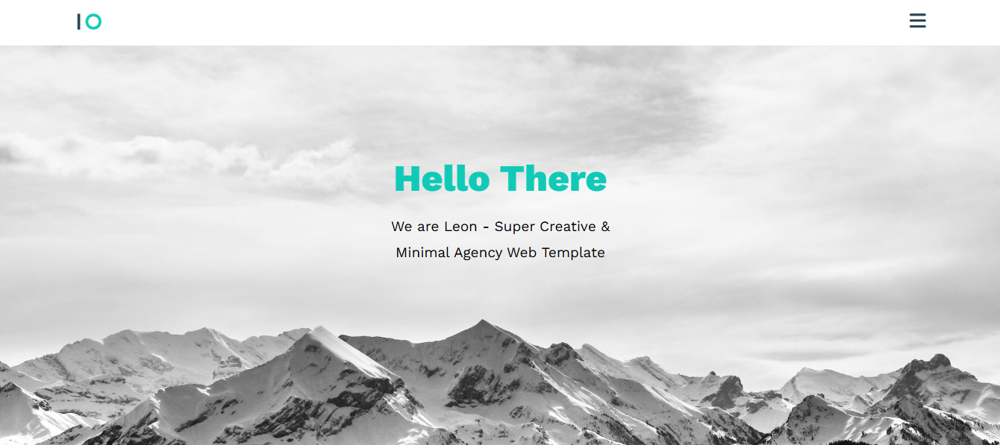
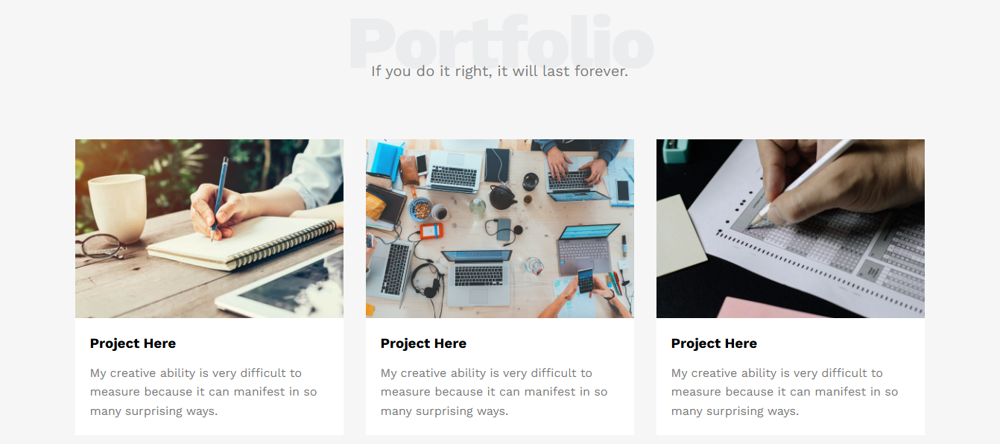
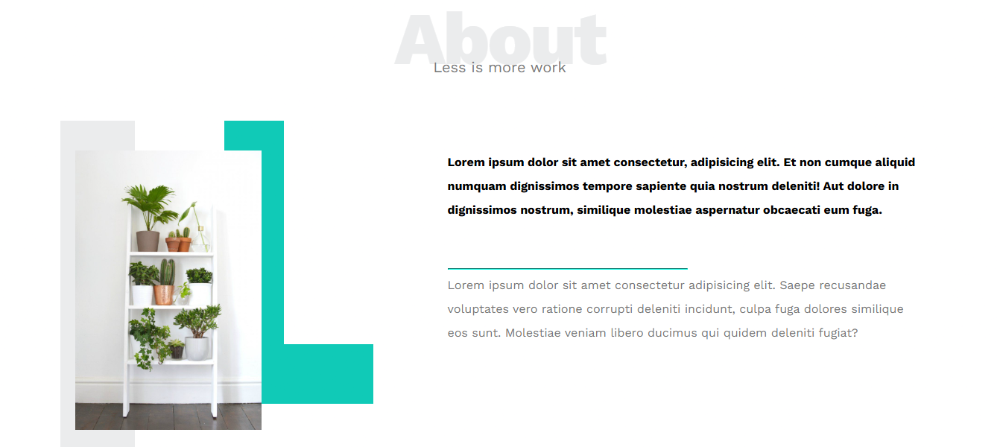

# Leon HTML & CSS Project 1

A responsive landing page built using **HTML5 and CSS3**, inspired by the Leon Template from **Elzero Web School**.

This project was created as part of my front-end development practice to strengthen my HTML and CSS fundamentals and improve my ability to build responsive layouts from scratch.

## ✨ Features

* Responsive design for different screen sizes
* Semantic HTML5 structure
* Clean and organized CSS
* Flexbox layouts
* CSS Grid
* Responsive navigation
* Responsive sections and images
* Mobile-friendly design

## 🛠️ Technologies

* HTML5
* CSS3
* Flexbox
* CSS Grid
* Media Queries

## 📂 Project Structure

```text
Leon-HTML-CSS-Project1/
│
├── css/
│   ├── normalize.css
│   └── style.css
│
├── images/
│   ├── Leon-Logo.png
│   ├── landing-image.jpg
│   ├── about.jpg
│   ├── portfolio-1.jpg
│   ├── portfolio-2.jpg
│   ├── portfolio-3.jpg
│   └── services-images.jpg
│
├── index.html
└── README.md
```

## 🎯 What I Practiced

Through this project, I practiced:

* Structuring web pages using HTML5
* Creating reusable and organized CSS rules
* Building layouts with Flexbox and CSS Grid
* Working with responsive designs
* Using media queries for mobile devices
* Positioning and styling elements
* Organizing project files and assets
* Improving my understanding of responsive web development

## 📸 Preview








## 🚀 Project Status

Completed as part of my **Front-End Development learning journey**.

## 👩‍💻 Author

**Hagar Khaled Niazi**

Front-End Developer in progress.

