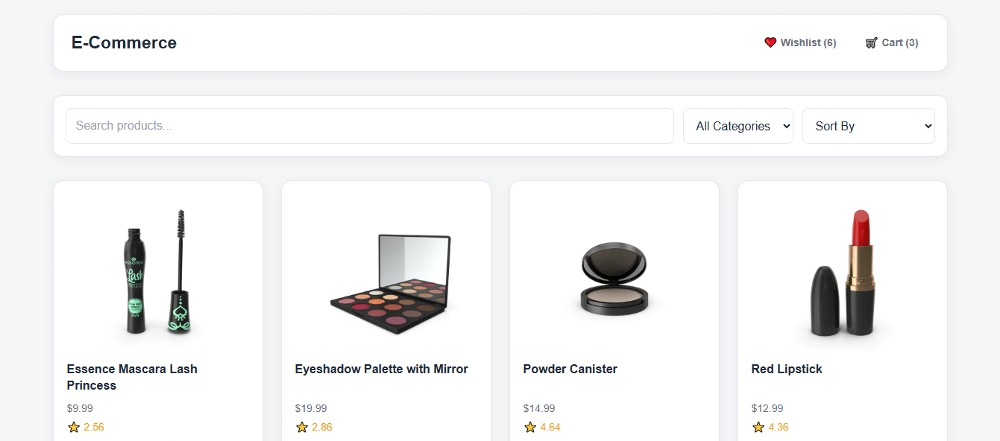
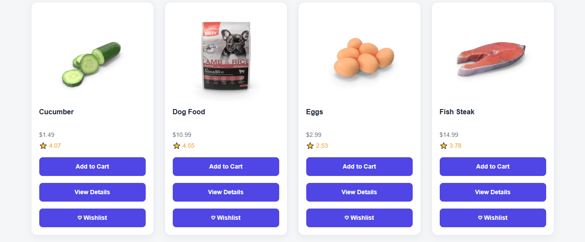
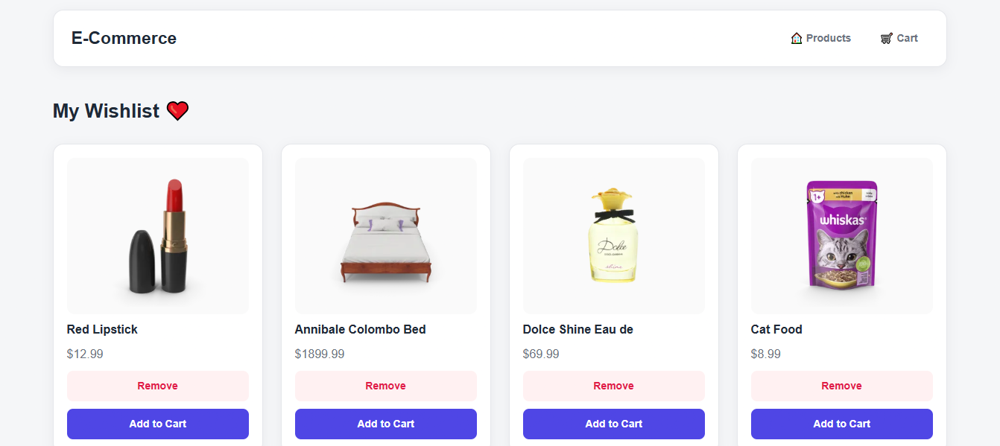
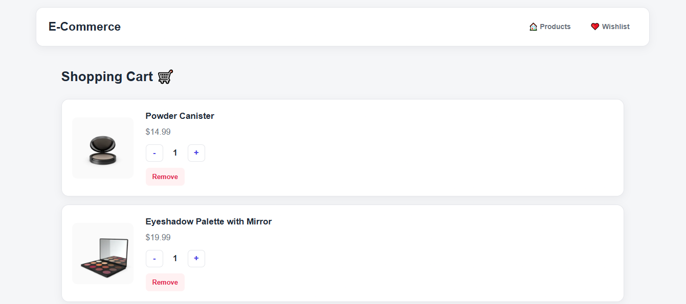

# E-Commerce - HTML, CSS & JavaScript Project 3

A responsive E-Commerce website built using **HTML5, CSS3, and JavaScript**.

This project was created as part of my front-end development practice to strengthen my JavaScript fundamentals and learn how to build a complete interactive web application using APIs, the DOM, event listeners, arrays, objects, localStorage, and dynamic rendering.

## ✨ Features

* Display products fetched from an external API
* Search products by name
* Filter products by category
* Sort products by price
* View detailed information for each product
* Add products to the shopping cart
* Increase and decrease product quantity
* Remove products from the shopping cart
* Calculate the total cart price
* Save cart data using localStorage
* Keep cart products after refreshing the page
* Add products to the wishlist
* Remove products from the wishlist
* Save wishlist data using localStorage
* Keep wishlist products after refreshing the page
* Add wishlist products directly to the cart
* Navigate between Products, Cart, Wishlist, and Product Details pages
* Interactive buttons with hover effects
* Responsive design for mobile devices
* Clean and modern user interface

## 🛠️ Technologies

* HTML5
* CSS3
* JavaScript
* DummyJSON API
* Fetch API
* DOM Manipulation
* Event Listeners
* JavaScript Arrays
* JavaScript Objects
* Functions
* localStorage
* JSON
* Array Methods
* CSS Grid
* CSS Flexbox
* Responsive Design

## 📂 Project Structure

```text
E-Commerce-HTML-CSS-JS-Project3/
│
├── css/
│   └── style.css
│
├── js/
│   ├── main.js
│   ├── cart.js
│   ├── wishlist.js
│   └── product-details.js
│
├── index.html
├── cart.html
├── wishlist.html
├── product-details.html
└── README.md
```

## 🎯 What I Practiced

Through this project, I practiced:

* Using JavaScript variables with `let` and `const`
* Selecting HTML elements using `getElementById()`
* Creating HTML elements dynamically using `createElement()`
* Adding elements to the page using `appendChild()`
* Handling user interactions with `addEventListener()`
* Working with input and change events
* Creating and using JavaScript functions
* Working with arrays and objects
* Using array methods such as `forEach()`, `filter()`, `find()`, `map()`, and `reduce()`
* Filtering products based on user input
* Searching products dynamically
* Sorting products by price
* Creating product cards dynamically
* Rendering products using JavaScript
* Working with external APIs
* Using the `fetch()` API
* Working with Promises and `.then()`
* Converting API responses using `response.json()`
* Reading URL parameters using `URLSearchParams`
* Creating dynamic product details pages
* Building a shopping cart system
* Managing product quantities
* Calculating the total cart price
* Building a wishlist system
* Using `localStorage` to save application data
* Using `JSON.stringify()` to store JavaScript data
* Using `JSON.parse()` to retrieve stored data
* Keeping cart and wishlist data after refreshing the page
* Connecting multiple HTML pages together
* Creating responsive layouts using CSS Grid and Flexbox
* Building a complete interactive E-Commerce project

## 📸 Preview







## 🚀 Project Status

Completed as part of my **Front-End Development learning journey**.

## 👩‍💻 Author

**Hagar Khaled Niazi**

Front-End Developer in progress.
