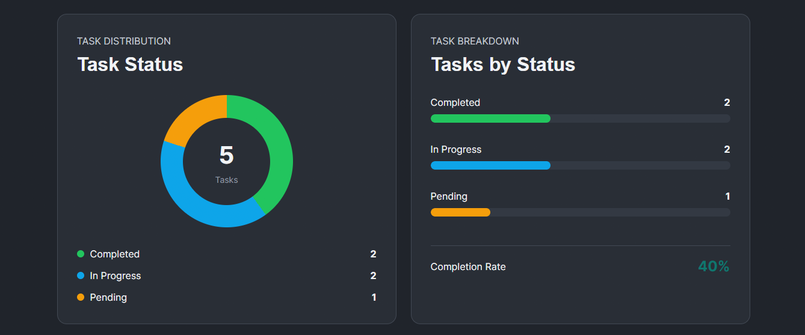
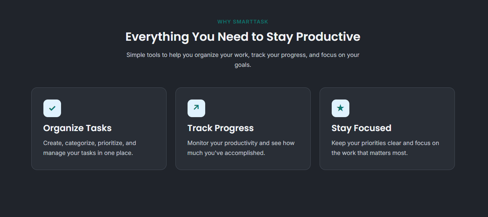
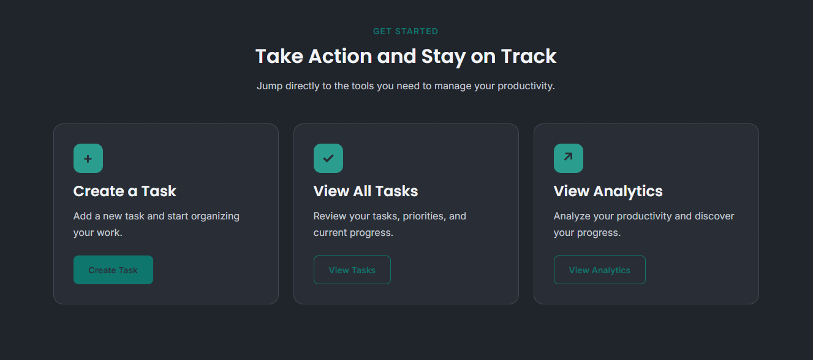
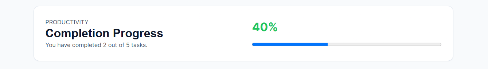
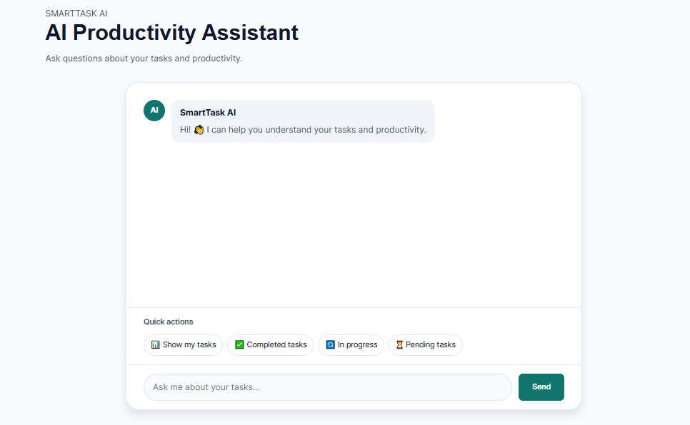
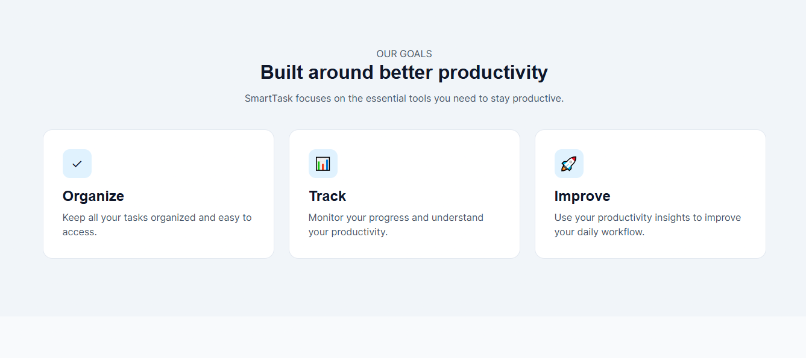
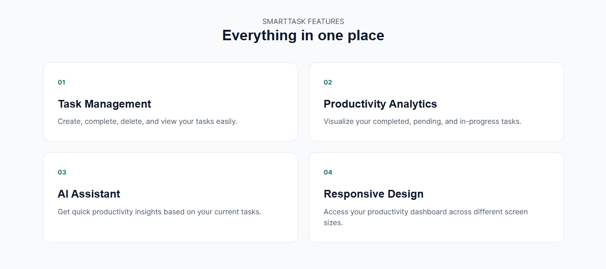
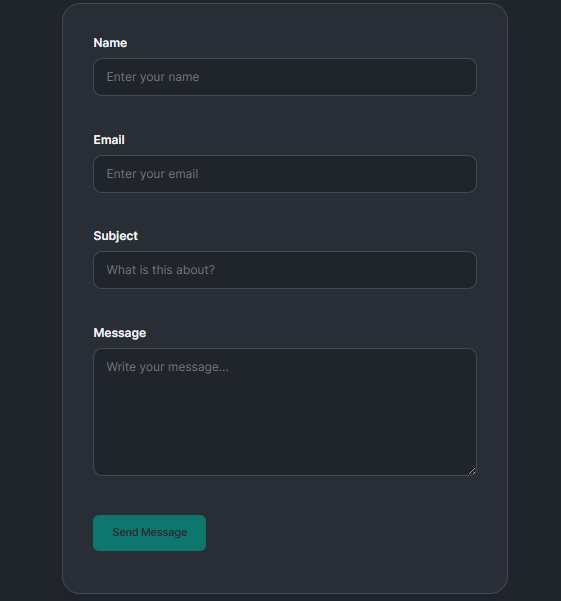

# SmartTask — Productivity & Task Management Dashboard

A responsive productivity and task management dashboard built using **HTML5, CSS3, and JavaScript**.

This project was created after completing the **Cisco HTML, CSS, JavaScript Essentials 1, and JavaScript Essentials 2 courses** as a practical project to apply and strengthen the concepts I learned throughout these courses.

## ✨ Features

* Responsive multi-page dashboard
* Add new tasks
* Complete tasks
* Delete tasks
* View task details
* Search tasks by title
* Debounced task search
* Save tasks using localStorage
* Keep tasks after refreshing the page
* Keep task status after refreshing the page
* Dashboard with task statistics
* Dynamic analytics and productivity charts
* Mock AI Assistant based on task data
* Contact form with validation
* Email validation using Regular Expressions
* Light and Dark mode
* Save selected theme using localStorage
* Mobile navigation menu
* Responsive design for desktop, tablet, and mobile devices
* Interactive buttons and UI elements

## 🛠️ Technologies

* HTML5
* CSS3
* JavaScript
* DOM Manipulation
* Event Listeners
* JavaScript Arrays
* JavaScript Objects
* Functions
* JavaScript Classes
* Object-Oriented Programming
* Fetch API
* Promises
* JSON
* localStorage
* URLSearchParams
* Regular Expressions
* Debounce
* CSS Variables
* CSS Flexbox
* CSS Grid
* CSS `conic-gradient()`
* Responsive Design

## 📂 Project Structure

```text
SmartTask/
│
├── css/
│   ├── base/
│   ├── components/
│   ├── pages/
│   ├── responsive/
│   └── animations/
│
├── js/
│   ├── core/
│   ├── components/
│   ├── pages/
│   ├── data/
│   ├── utils/
│   └── labs/
│
├── pages/
│   ├── dashboard.html
│   ├── tasks.html
│   ├── task-details.html
│   ├── analytics.html
│   ├── ai-assistant.html
│   ├── about.html
│   └── contact.html
│
├── data/
│   ├── tasks.json
│   ├── users.json
│   └── categories.json
│
├── assets/
│   ├── images/
│   ├── icons/
│   ├── audio/
│   └── video/
│
├── experiments/
├── docs/
├── index.html
└── README.md
```

## 🎯 What I Practiced

Through this project, I practiced:

* Using JavaScript variables with `let` and `const`
* Working with primitive data types
* Using conditional statements
* Creating and using JavaScript functions
* Working with strings, numbers, and booleans
* Working with JavaScript arrays and objects
* Using array methods such as `forEach()`, `map()`, `filter()`, and `find()`
* Selecting HTML elements using `querySelector()`
* Creating HTML elements dynamically using `createElement()`
* Adding elements to the page using `appendChild()`
* Updating HTML content using `textContent`
* Manipulating element classes using `classList`
* Handling user interactions using `addEventListener()`
* Handling form submission and validation
* Using Regular Expressions for email validation
* Working with JavaScript classes and Object-Oriented Programming
* Using `fetch()` to load JSON data
* Working with Promises using `.then()` and `.catch()`
* Using `JSON.parse()` and `JSON.stringify()`
* Using `localStorage` to save application data
* Loading saved data when the page opens
* Using `URLSearchParams` to read URL parameters
* Creating dynamic pages based on URL parameters
* Implementing search functionality
* Using debounce to improve search performance
* Creating Light and Dark mode
* Saving the selected theme using `localStorage`
* Creating responsive layouts with CSS
* Using CSS variables for reusable styles
* Building charts using CSS
* Connecting HTML, CSS, and JavaScript together
* Organizing a larger front-end project into separate files
* Building a complete multi-page interactive web application

## 📚 Course Background

This project was created after completing:

* **Cisco — HTML**
* **Cisco — CSS**
* **Cisco / OpenEDG — JavaScript Essentials 1**
* **Cisco / OpenEDG — JavaScript Essentials 2**

The project was built to put the knowledge from these courses into practice through one complete front-end application.

## 📸 Preview

SmartTask Preview:

<p align="center">
  
  
  
  
  
  
  
  
</p>

## 🚀 Project Status

Completed as part of my **Front-End Development learning journey** after completing the Cisco HTML, CSS, JavaScript Essentials 1, and JavaScript Essentials 2 courses.

## 👩‍💻 Author

**Hagar Khaled Niazi**

Front-End Developer in progress.
