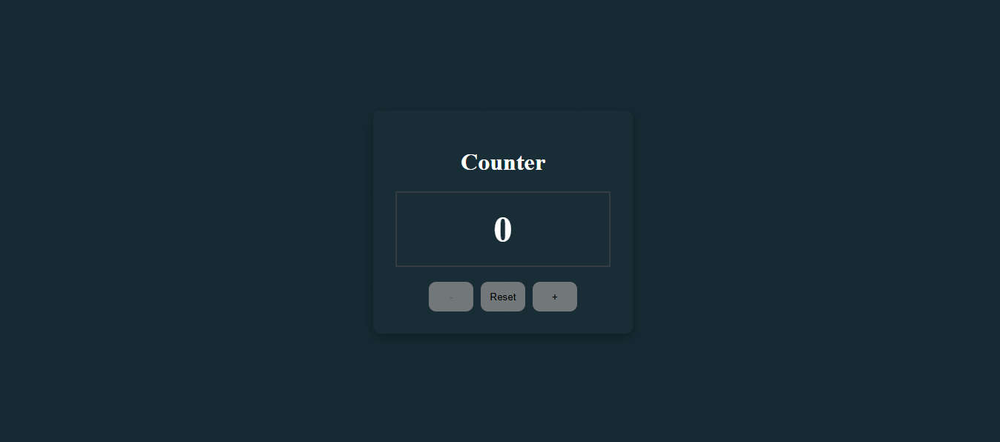

# Simple Counter - HTML, CSS & JavaScript Project 1

A simple counter application built using **HTML5, CSS3, and JavaScript**.

This project was created as part of my front-end development practice to strengthen my JavaScript fundamentals and learn how to make web pages interactive using the DOM and event listeners.

## ✨ Features

- Increase the counter
- Decrease the counter
- Reset the counter
- Prevent the counter from going below zero
- Disable the decrease button when the counter reaches zero
- Change the counter color when its value increases
- Interactive buttons with hover effects
- Simple and clean user interface

## 🛠️ Technologies

- HTML5
- CSS3
- JavaScript
- DOM Manipulation
- Event Listeners
- CSS Flexbox

## 📂 Project Structure

SimpleCounter-HTML-CSS-JS-Project1/
│
├── css/
│   └── style.css
│
├── js/
│   └── script.js
│
├── index.html
└── README.md

## 🎯 What I Practiced

Through this project, I practiced:

- Using JavaScript variables with `let` and `const`
- Selecting HTML elements using `getElementById()`
- Handling user interactions with `addEventListener()`
- Working with click events
- Updating HTML content using `textContent`
- Using conditional statements with `if` and `else`
- Creating and using JavaScript functions
- Using `classList.add()` and `classList.remove()`
- Controlling HTML attributes with JavaScript
- Using the `disabled` attribute
- Connecting JavaScript with HTML and CSS
- Building my first interactive JavaScript project

## 📸 Preview

## 🚀 Project Status

Completed as part of my **Front-End Development learning journey**.

## 👩‍💻 Author

**Hagar Khaled Niazi**

Front-End Developer in progress.