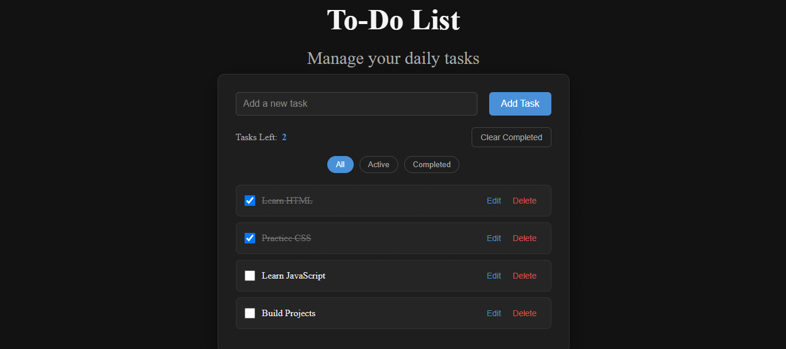
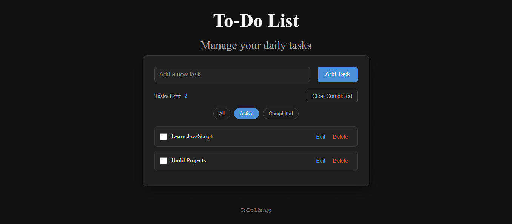
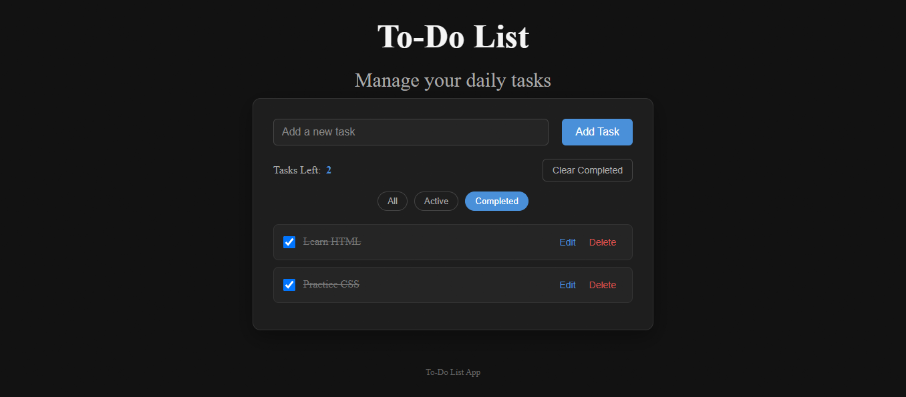

# To-Do List - HTML, CSS & JavaScript Project 2

A responsive To-Do List application built using **HTML5, CSS3, and JavaScript**.

This project was created as part of my front-end development practice to strengthen my JavaScript fundamentals and learn how to build interactive web applications using the DOM, event listeners, arrays, objects, and localStorage.

## ✨ Features

* Add new tasks
* Prevent adding empty tasks
* Mark tasks as completed
* Unmark completed tasks
* Edit existing tasks
* Delete tasks
* Display the number of active tasks
* Filter tasks by All, Active, and Completed
* Clear all completed tasks
* Save tasks using localStorage
* Keep tasks after refreshing the page
* Keep completed status after refreshing the page
* Add tasks using the Enter key
* Interactive buttons with hover effects
* Responsive design for mobile devices
* Dark mode user interface with blue accent color

## 🛠️ Technologies

* HTML5
* CSS3
* JavaScript
* DOM Manipulation
* Event Listeners
* JavaScript Arrays
* JavaScript Objects
* Functions
* localStorage
* JSON
* CSS Flexbox
* Responsive Design

## 📂 Project Structure

```text
todoList-HTML-CSS-JS-Project2/
│
├── css/
│   └── style.css
│
├── js/
│   └── script.js
│
├── index.html
└── README.md
```

## 🎯 What I Practiced

Through this project, I practiced:

* Using JavaScript variables with `let` and `const`
* Selecting HTML elements using `getElementById()` and `querySelector()`
* Creating HTML elements dynamically using `createElement()`
* Adding elements to the page using `appendChild()`
* Handling user interactions with `addEventListener()`
* Working with click, change, and keydown events
* Updating HTML content using `textContent`
* Creating and using JavaScript functions
* Working with arrays and objects
* Using array methods such as `forEach()` and `filter()`
* Using `classList.add()`, `classList.remove()`, and `classList.toggle()`
* Creating dynamic task elements with JavaScript
* Handling task completion states
* Editing and deleting dynamically created elements
* Using `localStorage` to save application data
* Using `JSON.stringify()` to store JavaScript data
* Using `JSON.parse()` to retrieve stored data
* Loading saved tasks when the page opens
* Rendering saved tasks dynamically
* Building filters for different task states
* Creating a responsive user interface with CSS
* Connecting HTML, CSS, and JavaScript together
* Building a complete interactive JavaScript project

## 📸 Preview





## 🚀 Project Status

Completed as part of my **Front-End Development learning journey**.

## 👩‍💻 Author

**Hagar Khaled Niazi**

Front-End Developer in progress.
