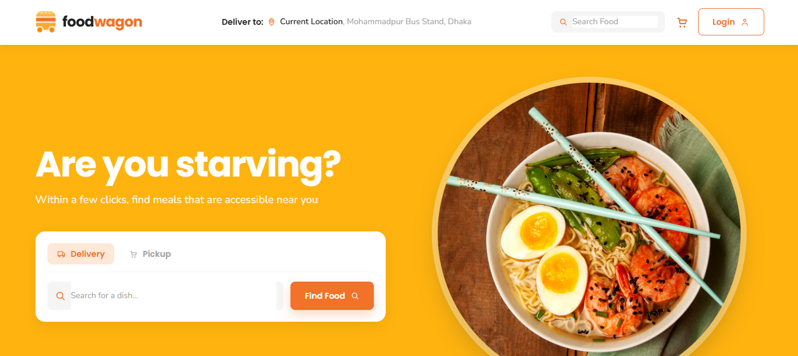
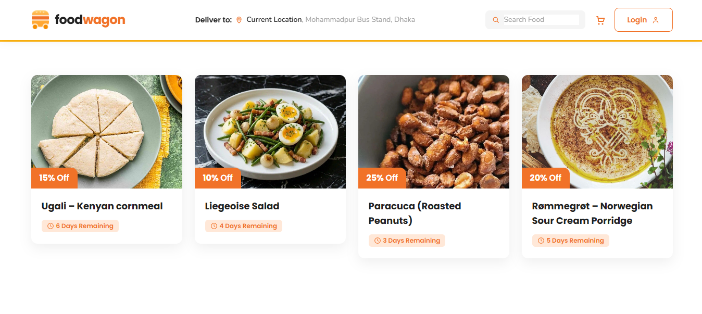
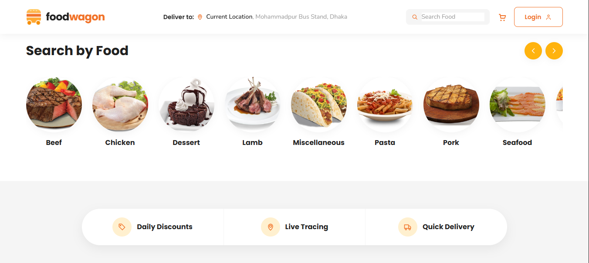
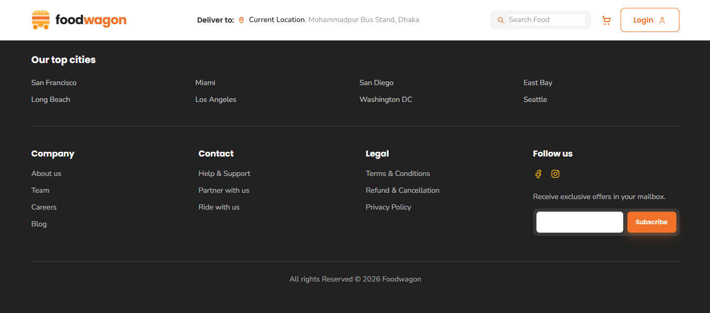
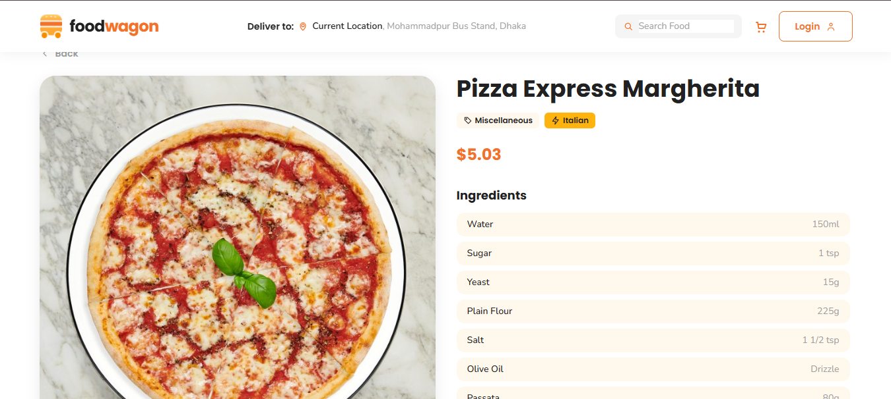
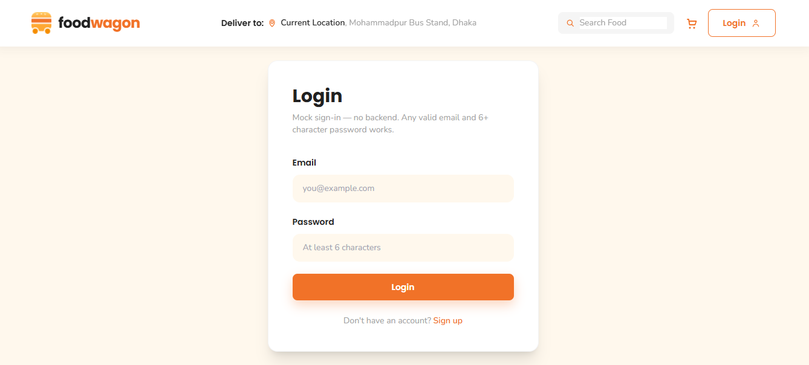
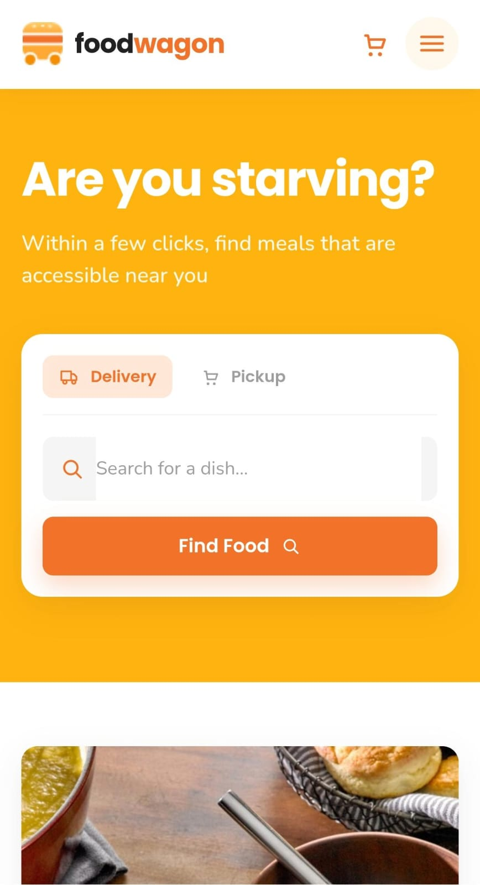
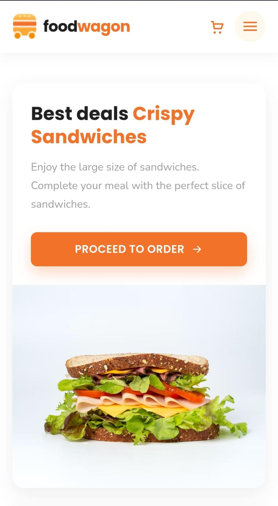
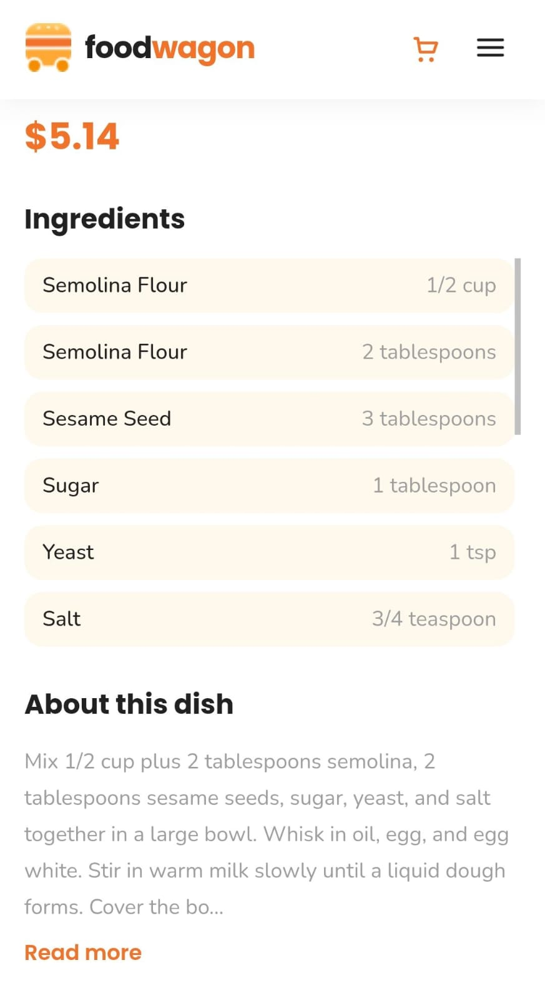

# 🍔 Foodwagon Clone

A full-featured food delivery web app built with React, cloning the Foodwagon landing page design end-to-end — from static UI to real API data, search & filtering, cart, and mock authentication.

## 📸 Screenshots

### Desktop








### Mobile





## 🔗 Live Demo

**[View Live Demo](https://frontend-practice-fyl4.vercel.app/)**

## ✨ Features

- Fully responsive, pixel-matched UI (mobile, tablet, desktop)
- Real meal data fetched from [TheMealDB API](https://www.themealdb.com/api.php)
- Search meals by name and filter by category
- Meal details page with ingredients, instructions, and pricing
- Shopping cart with add/remove/update quantity, persisted in localStorage
- Mock authentication (Login / Signup / Logout) with protected UI state
- Fully built-out footer pages (About, Team, Careers, Blog, Help, Legal, City pages)
- Custom design system built with Tailwind CSS (colors, typography, spacing)

## 🛠️ Tech Stack

- **React** (Vite)
- **React Router DOM** — client-side routing
- **Tailwind CSS** — styling & design system
- **Context API** — cart & auth state management
- **TheMealDB API** — real meal/food data
- **localStorage** — cart & auth persistence

## 🚀 Getting Started

```bash
# Clone the repo
git clone https://github.com/hagarniazi/Frontend-Practice.git

# Navigate to the project
cd Frontend-Practice/React/project-1-foodwagon

# Install dependencies
npm install

# Run the development server
npm run dev
```

## 🗺️ Roadmap

- [x] Project setup (Vite + React + Tailwind + Router)
- [x] Reusable component library
- [x] Static Home page assembly
- [x] Real API integration (TheMealDB)
- [x] Search & category filtering
- [x] Meal details page & cart/order flow
- [x] Responsiveness & polish
- [x] Full interactivity (auth, footer pages)
- [x] Deployment (GitHub + Live Demo)

## 👩‍💻 Author

**Hagar** — Front-End Developer
[GitHub](https://github.com/hagarniazi)
[LinkedIn](https://www.linkedin.com/in/hagar-khaled-niazi)
